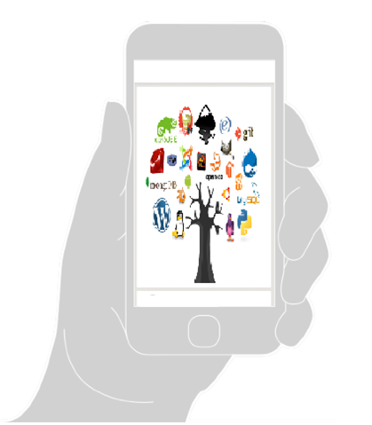

## The Open-source Hanbook

우리가 생활하면서 컴퓨터공학 전공이 아닌 사람들이 오픈소스라는 말을 들어봤을까? 아마 나도 모르게 어딘가-뉴스나 칼럼-에서 흘려 들었을지도 모른다. 지금 이 글을 쓰고 있는 자신도 팀프로젝트를 할때 소스코드를 공부하면서 여러가지 검색하다가 오픈소스를 알게 되었고 그것의 효과를 톡톡히 봤다. 그만큼 요즘 IT시대\\(4차 산업혁명\\)에 많이 사용되고 있고 우리에게 중요한 개념이다. 

오픈소스 소프트웨어들은 다른 소프트웨어들보다 강력하고 활발하다. 마치 시장과도 같다. 그런 오픈소스의 특성때문에 생각보다 많은 부분이 오픈소스 소프트웨어로 되어 있고 나도 모르게 그것을 사용하고 있다. 오픈소스 세계는 앞으로 더욱 커지고 중요해질 것이다.

\_-Team red-05\_

---

<iframe width="100%" height="360" src="https://www.youtube.com/embed/4ZHloJVhcRY" frameborder="0" allowfullscreen></iframe>

[VIDEO](https://www.youtube.com/watch?v=4ZHloJVhcRY): 오픈소스, 자유 소프트웨어 운동의 20년을 추적한 다큐

